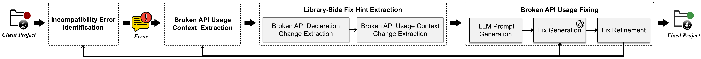

## Librarian: Fixing Incompatibility Errors Guided by Library Knowledge for Automatic Library Upgrade

---
Librarian is a **LLM-based** approach designed to fix incompatibility errors in client projects after upgrading a dependent library. It combines client‑side broken API usage context with library‑side fix hints in four LLM‑empowered phases: first identifying and heuristically ordering compilation errors, then extracting inter‑procedural data‑flow slices around each broken API in the client, next mining declaration changes and usage‑context diffs across library versions, and finally driving an LLM to generate and iteratively refine targeted fixes based on compilation feedback. Our approach surpasses the state‑of‑the‑art.

### Overview
<p style="text-align: center;">
    
</p>


### Getting Started
#### File Structure
- `assets/`: Contains resource files related to `README.md`
- `Benchmark/`: Contains the benchmark used in our paper
- `strange-cli/`: Contains the program’s entry-point code
- `strange-broken-api-analysis/`: Contains the code for analyzing broken APIs
- `strange-usage-fix-engine/`: Contains the code for fixing broken API usages
- `strange-library-knowledge-collector/`: Contains the code for downloading library JARs and source JARs

#### Requirements
- Java version: 17
- Apache Maven 3.8.8
- Jenv 0.5.7

#### Download Library
First, download the library JARs and source‑code JARs from Maven Central.

- **Single‑Library Download.** To download a single artifact, invoke the `SingleLibraryKnowledgeCollector` with the group and artifact coordinates:
```java
public static void main(String[] args) {
        SingleLibraryKnowledgeCollector collector = new SingleLibraryKnowledgeCollector("org.locationtech.jts", "jts-core");
        collector.collect();
        log.info("✅ Collection Finish");
    }
```

- **Batch‑Library Download.** For bulk operations, list all desired artifacts in `strange-library-knowledge-collector/src/main/resources/library_list.json` 
```json
[
  {
    "group_id": "com.aliyun.openservices",
    "artifact_id": "aliyun-log-producer"
  }
  // ... add as many libraries as needed
]
```
And then start the application to download the libraries.
```java
public static void main(String[] args) throws IOException {
        SpringApplication.run(LibraryKnowledgeApplication.class, args);
        server.start();
    }
```

Configure download settings in `strange-library-knowledge-collector/src/main/resources/application.properties`
```properties
# Name of the Spring Boot application
spring.application.name=library-knowledge-collector-server

# Relative path (from classpath) to the library list
config.library-list-file-name=library_list.json

# Root directory where downloaded JARs will be stored
config.knowledge-root-path=/path/to/your/storage

# Number of concurrent download threads (tune for your environment)
config.collect-thread-number=80
```

#### Run Tool
Once all libraries have been downloaded, set up the Librarian by editing `strange-cli/src/main/resources/application.properties`
```properties
# Root directory of the downloaded libraries
config.library-database-path=/path/to/your/library/database

# Directory where the fixed projects will be output
config.fix-space-dir=/path/to/your/fix/output

# Your LLM API key
config.llm.api-key=your-api-key

# Base URL for your LLM endpoint
config.llm.base-url=https://api.example.com/v1

# Model name to use with the LLM
config.llm.model-name=your-model-name
```
Then, build the source code of Librarian.
```shell
bash build.bash  # Compile and package
```
Then, we will obtain an executable JAR file in `strange-cli/target/strange-cli-1.0-SNAPSHOT.jar`


Here, we introduce how to use the JAR file
```commandline
usage: java -jar strange-cli/target/strange-cli-1.0-SNAPSHOT.jar [-p [PROJECT_PATH]]

arguments:
  -p [PROJECT_PATH]         The path of the client project to be analyzed
```

If you encounter any other issues, please do not hesitate to contact us.
